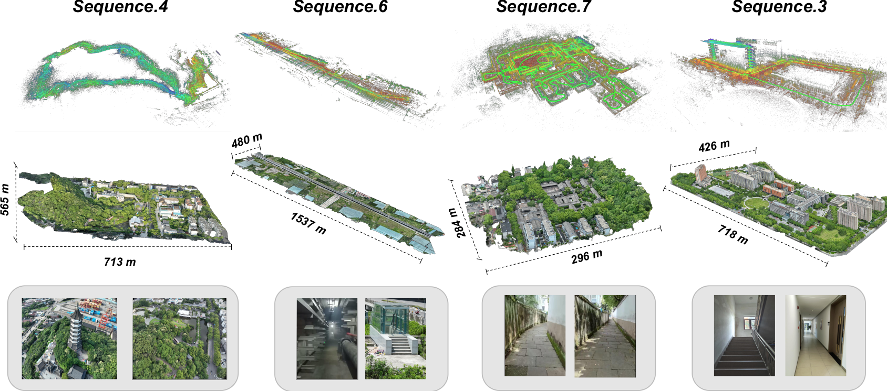

# Large-Scale LiDAR-Inertial Dataset for Degradation-Robust High-Precision Mapping

[](https://creativecommons.org/licenses/by-nc-sa/4.0/)

## 🎥 Demo

👉 [Download high resolution video](https://github.com/CNITECH-CV-LAB/Backpack2025/releases/download/v1.0/ral-video-2k.mp4)

### Dataset Structure
```
dataset_root/
└─ sequences/
├─ seq01/
│ ├─ bag/ # ROS bag with IMU (400Hz), LiDAR (dual 10Hz), RTK-GNSS (1Hz)
│ ├─ pcd/ # Deskewed LiDAR scans in .pcd format
│ │ ├─ 0.pcd
│ │ ├─ 1.pcd
│ │ └─ ...
│ ├─ gt/ # Ground truth poses
│ │ └─ GT_pose.txt # TUM format
│ └─ calib.yaml # Calibration parameters
├─ seq02/
│ └─ ...
└─ seq08/
```
## 📦 Dataset Download

The dataset is hosted on Google Drive.  
👉 You can download individual sequences using the links below:

| Sequence | Length (m) | Duration (s) | Size (GB) | Environment | Download |
|----------|------------|--------------|-----------|-------------|----------|
| Seq.1    | 1561.8     | 1558.3       | 82.0      | Dense building cluster (indoor corridors) | [Google Drive](https://drive.google.com/uc?export=download&id=1s_sdhkQ7Y_fUqMUQd8Yc1hGOYbanCqgk
) |
| Seq.2    | 1279.0     | 1174.9       | 65.3      | Dense building cluster (outdoor loop) | [Google Drive](https://drive.google.com/drive/folders/1HziXgwLYM4R3ScwpPa9ji5uLE7ymjoeT?usp=sharing) |
| Seq.3    | 1002.0     | 1626.6       | 88.7      | Multi-story, IO transitions | [Google Drive](https://drive.google.com/drive/folders/1RKTCS6SkJSslJZrW-drs64IWBfMAOWwK?usp=sharing) |
| Seq.4    | 1764.3     | 1688.1       | 97.2      | Mountainous terrain | [Google Drive](https://drive.google.com/drive/folders/10yHw_eOWycX2a0OnMJBLyoy-yjc826Dt?usp=sharing) |
| Seq.5    | 814.4      | 1101.6       | 62.0      | Multi-story tower | [Google Drive](https://drive.google.com/drive/folders/1xaCqjbXj2sNH95n96ffxfRvb3UWVtAcT?usp=sharing) |
| Seq.6    | 1833.2     | 1791.8       | 87.5      | Underground tunnel | [Google Drive](https://drive.google.com/drive/folders/1vhj8Q3JxPpNxt2TsAX2YkaGjcZ-I1Uuz?usp=sharing) |
| Seq.7    | 1505.4     | 1849.6       | 100.4     | Dense architecture, IO transitions | [Google Drive](https://drive.google.com/drive/folders/125LCBJGUaMmdgsdZeyWkj0_FLzLeJyxj?usp=sharing) |
| Seq.8    | 1307.8     | 1245.3       | 70.9      | Dense architecture, long corridor | [Google Drive](https://drive.google.com/drive/folders/1shiITpCrXfFCJXHbW1Tnt3Vusmg1c2M9?usp=sharing) |

## ⚙️ Calibration Usage

The `Calib.yaml` file contains parameters that need to be applied correctly in downstream algorithms.  
Below we provide pseudo-code to illustrate their usage:

```
// --- Time offset correction (LiDAR → IMU) ---
// Align IMU timestamps to LiDAR time
t_imu_aligned = t_imu_raw - time_offset_lidar_to_imu;


// --- LiDAR → IMU transformation ---
// Transform points from LiDAR frame to IMU frame
p_imu = R_L2I * p_lidar + t_L2I;


// --- Vertical LiDAR → Horizontal LiDAR transformation ---
// Convert points from vertical LiDAR frame into horizontal LiDAR frame
p_h = Extrinsic_V2H * p_v;   // homogeneous coordinates


// --- GPS lever arm (GPS → IMU) ---
// GPS antenna position expressed in IMU/body frame
p_gps = p_imu + R_IMU->World * gpsLevelArm;
```
